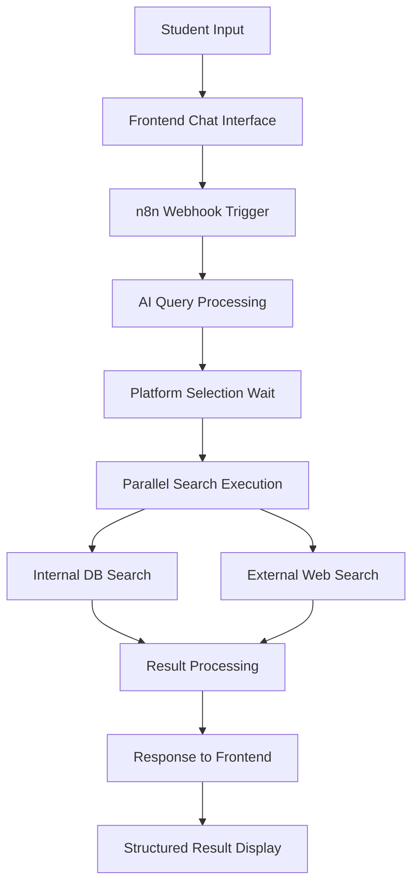

# Design Document

## Overview

The AI-powered mentor search feature is designed as a comprehensive solution that combines natural language processing, web scraping, and internal database queries to provide students with relevant mentor recommendations. The system uses a modern React frontend with an n8n workflow backend, leveraging webhook and wait node patterns for real-time interaction.

The architecture follows a three-tier approach: a responsive frontend chat interface, an n8n workflow orchestration layer, and multiple data sources (internal database and external web APIs). The design emphasizes user experience with real-time feedback, structured result presentation, and seamless integration with the existing Eagles mentorship platform.

## Architecture

### Frontend Architecture

The frontend is built using Next.js 15 with TypeScript and follows the existing project patterns:

- **Page Structure**: New route at `/mentors/search` with dedicated page component
- **Component Hierarchy**: 
  - `MentorSearchPage` (main page component)
  - `AnimatedAIChat` (existing chat interface component)
  - `PlatformSelector` (new checkbox component for platform selection)
  - `SearchResults` (new component for displaying results)
  - `MentorCard` (new component for individual mentor display)
- **State Management**: React hooks for local state, with real-time updates via webhook responses
- **Styling**: Tailwind CSS with existing design system components

### Backend Architecture (n8n Workflow)

The backend uses n8n workflow automation with the following node structure:

1. **Webhook Trigger**: Receives initial search queries from frontend
2. **AI Processing Node**: Uses Google Gemini to process natural language queries
3. **Wait Node**: Pauses for platform selection from user
4. **Parallel Search Nodes**: 
   - Internal database search (Supabase query)
   - External web search (Google Custom Search API)
5. **Data Processing Nodes**: Format and structure results
6. **Response Node**: Returns formatted results to frontend

### Data Flow Architecture



## Components and Interfaces

### Frontend Components

#### MentorSearchPage Component
```typescript
interface MentorSearchPageProps {
  // No props needed - self-contained page
}

interface SearchState {
  query: string
  isSearching: boolean
  platforms: string[]
  results: SearchResults | null
  error: string | null
}
```

#### PlatformSelector Component
```typescript
interface PlatformSelectorProps {
  platforms: Platform[]
  selectedPlatforms: string[]
  onSelectionChange: (platforms: string[]) => void
  onConfirm: () => void
}

interface Platform {
  id: string
  name: string
  description: string
  icon: React.ComponentType
}
```

#### SearchResults Component
```typescript
interface SearchResultsProps {
  results: SearchResults
  onMentorSelect: (mentor: InternalMentor | ExternalProfile) => void
}

interface SearchResults {
  internal: InternalMentor[]
  external: ExternalProfile[]
  query: string
  searchTime: number
}
```

#### MentorCard Component
```typescript
interface MentorCardProps {
  mentor: InternalMentor | ExternalProfile
  type: 'internal' | 'external'
  onAction: (action: string, mentor: any) => void
}
```

### Backend Interfaces (n8n Workflow Data)

#### Webhook Input Schema
```json
{
  "type": "object",
  "properties": {
    "query": {"type": "string"},
    "platforms": {"type": "array", "items": {"type": "string"}},
    "userId": {"type": "string"},
    "step": {"type": "string", "enum": ["initial", "platform_selection", "search"]}
  }
}
```

#### Search Response Schema
```json
{
  "type": "object",
  "properties": {
    "success": {"type": "boolean"},
    "data": {
      "type": "object",
      "properties": {
        "internal": {"type": "array"},
        "external": {"type": "array"},
        "query": {"type": "string"},
        "searchTime": {"type": "number"}
      }
    },
    "resumeUrl": {"type": "string"},
    "error": {"type": "string"}
  }
}
```

### API Interfaces

#### Internal Mentor Search
```typescript
interface InternalMentor {
  id: string
  user_id: string
  full_name: string
  department: string | null
  year: number | null
  expertise_tags: string[]
  bio: string | null
  avatar_url: string | null
  availability_status: 'available' | 'busy' | 'offline'
  role_title: string
  relevance_score?: number
}
```

#### External Profile Search
```typescript
interface ExternalProfile {
  name: string | null
  title: string | null
  link: string
  snippet: string | null
  image: string | null
  platform: string
  relevance_score?: number
}
```

## Data Models

### Database Extensions

The existing database schema requires minimal changes. We'll add a new table for search analytics:

```sql
CREATE TABLE mentor_search_logs (
  id UUID PRIMARY KEY DEFAULT gen_random_uuid(),
  user_id UUID REFERENCES profiles(id),
  query TEXT NOT NULL,
  platforms TEXT[] DEFAULT '{}',
  internal_results_count INTEGER DEFAULT 0,
  external_results_count INTEGER DEFAULT 0,
  search_duration_ms INTEGER,
  created_at TIMESTAMP WITH TIME ZONE DEFAULT NOW()
);
```

### Search Configuration

Platform configuration stored as JSON:

```typescript
interface SearchPlatform {
  id: string
  name: string
  description: string
  searchTemplate: string // e.g., "site:linkedin.com/in {query} IUT"
  enabled: boolean
  icon: string
}

const DEFAULT_PLATFORMS: SearchPlatform[] = [
  {
    id: 'linkedin',
    name: 'LinkedIn',
    description: 'Professional networking profiles',
    searchTemplate: 'site:linkedin.com/in {query} "Islamic University of Technology"',
    enabled: true,
    icon: 'linkedin'
  },
  {
    id: 'facebook',
    name: 'Facebook',
    description: 'Social media profiles',
    searchTemplate: 'site:facebook.com {query} IUT Gazipur',
    enabled: true,
    icon: 'facebook'
  },
  {
    id: 'scholar',
    name: 'Google Scholar',
    description: 'Academic profiles and publications',
    searchTemplate: 'site:scholar.google.com {query} "Islamic University of Technology"',
    enabled: true,
    icon: 'graduation-cap'
  }
]
```

## Error Handling

### Frontend Error Handling

1. **Network Errors**: Display user-friendly messages with retry options
2. **Search Timeout**: Show timeout message after 30 seconds with option to try again
3. **No Results**: Display helpful suggestions for refining search queries
4. **Invalid Input**: Validate queries and provide guidance for better results

### Backend Error Handling (n8n Workflow)

1. **API Rate Limits**: Implement exponential backoff and queue management
2. **Search API Failures**: Graceful degradation - continue with available results
3. **Data Processing Errors**: Log errors and return partial results when possible
4. **Webhook Failures**: Implement retry mechanism with exponential backoff

### Error Response Format

```typescript
interface ErrorResponse {
  success: false
  error: {
    code: string
    message: string
    details?: any
  }
  partial_results?: SearchResults
}
```

## Testing Strategy

### Unit Testing

1. **Component Testing**: Test all React components with Jest and React Testing Library
2. **Utility Function Testing**: Test search query processing and data formatting functions
3. **Type Safety**: Ensure TypeScript interfaces match actual data structures

### Integration Testing

1. **n8n Workflow Testing**: Test complete workflow execution with mock data
2. **API Integration Testing**: Test Google Custom Search API integration
3. **Database Integration Testing**: Test internal mentor search queries

### End-to-End Testing

1. **User Journey Testing**: Complete search flow from query input to result display
2. **Cross-browser Testing**: Ensure compatibility across modern browsers
3. **Mobile Responsiveness Testing**: Test on various device sizes

### Performance Testing

1. **Search Response Time**: Target < 5 seconds for complete search results
2. **Concurrent User Testing**: Test system behavior with multiple simultaneous searches
3. **Large Result Set Testing**: Test UI performance with many search results

### Test Data Strategy

1. **Mock Internal Mentors**: Create diverse test mentor profiles
2. **Mock External Results**: Simulate various external search result formats
3. **Edge Case Data**: Test with empty results, malformed data, and error conditions

## Security Considerations

### Input Validation

1. **Query Sanitization**: Prevent injection attacks in search queries
2. **Rate Limiting**: Implement per-user search rate limits
3. **Input Length Limits**: Restrict query length to prevent abuse

### Data Privacy

1. **Search Logging**: Log searches for analytics but respect user privacy
2. **External Data Handling**: Don't store external profile data permanently
3. **User Consent**: Inform users about external search functionality

### API Security

1. **Webhook Authentication**: Secure n8n webhook endpoints
2. **API Key Management**: Secure storage of Google Custom Search API keys
3. **CORS Configuration**: Proper CORS setup for frontend-backend communication

## Performance Optimization

### Frontend Optimization

1. **Component Lazy Loading**: Load search components only when needed
2. **Result Virtualization**: Efficiently render large result sets
3. **Image Optimization**: Lazy load and optimize mentor profile images
4. **Caching**: Cache search results for repeated queries

### Backend Optimization

1. **Parallel Processing**: Execute internal and external searches concurrently
2. **Result Caching**: Cache external search results for common queries
3. **Database Indexing**: Optimize mentor search queries with proper indexes
4. **API Rate Management**: Efficient use of Google Custom Search API quota

### Search Optimization

1. **Query Preprocessing**: Optimize search queries for better results
2. **Result Ranking**: Implement relevance scoring for better result ordering
3. **Duplicate Detection**: Remove duplicate profiles across sources
4. **Result Pagination**: Implement pagination for large result sets