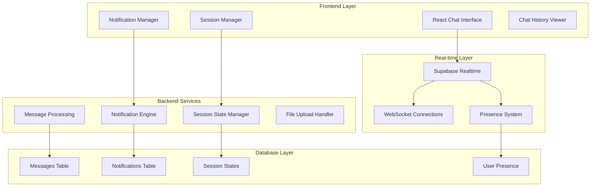

# Chat & Notifications System Design

## Overview

The enhanced chat and notifications system for the Eagles mentorship platform is built on Supabase Realtime for instant communication, with a comprehensive notification system, persistent chat history, and advanced session management. The architecture ensures scalability, real-time performance, and production-grade reliability.

The system uses WebSocket connections for real-time communication, database triggers for automated notifications, and optimized queries for chat history management.

## Architecture

### System Architecture



### Technology Stack

- **Real-time Communication**: Supabase Realtime with WebSocket connections
- **Message Storage**: PostgreSQL with optimized indexing
- **File Handling**: Supabase Storage with CDN delivery
- **Notifications**: Database triggers + real-time subscriptions
- **State Management**: React Context + Zustand for complex state
- **UI Components**: Enhanced shadcn/ui components for chat interface

## Components and Interfaces

### Core Chat Components

#### Real-time Chat Interface
```typescript
interface ChatInterfaceProps {
  sessionId: string
  currentUser: User
  onMessageSent?: (message: Message) => void
  onTyping?: (isTyping: boolean) => void
}

interface Message {
  id: string
  session_id: string
  sender_id: string
  content: string
  message_type: 'text' | 'file' | 'image' | 'system'
  file_url?: string
  reply_to?: string
  reactions?: MessageReaction[]
  edited_at?: string
  deleted_at?: string
  created_at: string
}
```

#### Session Management
```typescript
interface SessionManager {
  acceptSession: (sessionId: string) => Promise<void>
  declineSession: (sessionId: string, reason?: string) => Promise<void>
  updateSessionStatus: (sessionId: string, status: SessionStatus) => Promise<void>
  getSessionParticipants: (sessionId: string) => Promise<User[]>
}

interface SessionStatus {
  status: 'requested' | 'accepted' | 'declined' | 'in_progress' | 'completed' | 'expired'
  updated_by: string
  updated_at: string
  metadata?: Record<string, any>
}
```

#### Notification System
```typescript
interface NotificationManager {
  sendNotification: (notification: CreateNotification) => Promise<void>
  markAsRead: (notificationIds: string[]) => Promise<void>
  getNotifications: (userId: string, filters?: NotificationFilters) => Promise<Notification[]>
  subscribeToNotifications: (userId: string, callback: (notification: Notification) => void) => void
}

interface Notification {
  id: string
  user_id: string
  type: NotificationType
  title: string
  message: string
  data?: Record<string, any>
  read_at?: string
  created_at: string
}
```

## Data Models

### Enhanced Database Schema

```sql
-- Enhanced messages table with advanced features
CREATE TABLE messages (
  id UUID PRIMARY KEY DEFAULT gen_random_uuid(),
  session_id UUID REFERENCES sessions(id) ON DELETE CASCADE,
  sender_id UUID REFERENCES profiles(id),
  content TEXT,
  message_type TEXT DEFAULT 'text' CHECK (message_type IN ('text', 'file', 'image', 'system')),
  file_url TEXT,
  file_name TEXT,
  file_size INTEGER,
  reply_to UUID REFERENCES messages(id),
  edited_at TIMESTAMP,
  deleted_at TIMESTAMP,
  metadata JSONB DEFAULT '{}',
  created_at TIMESTAMP DEFAULT NOW(),
  updated_at TIMESTAMP DEFAULT NOW()
);

-- Message reactions table
CREATE TABLE message_reactions (
  id UUID PRIMARY KEY DEFAULT gen_random_uuid(),
  message_id UUID REFERENCES messages(id) ON DELETE CASCADE,
  user_id UUID REFERENCES profiles(id),
  emoji TEXT NOT NULL,
  created_at TIMESTAMP DEFAULT NOW(),
  UNIQUE(message_id, user_id, emoji)
);

-- Comprehensive notifications table
CREATE TABLE notifications (
  id UUID PRIMARY KEY DEFAULT gen_random_uuid(),
  user_id UUID REFERENCES profiles(id),
  type TEXT NOT NULL CHECK (type IN (
    'session_request', 'session_accepted', 'session_declined', 
    'message_received', 'session_completed', 'mentor_approved',
    'system_announcement', 'reminder'
  )),
  title TEXT NOT NULL,
  message TEXT NOT NULL,
  data JSONB DEFAULT '{}',
  read_at TIMESTAMP,
  expires_at TIMESTAMP,
  priority INTEGER DEFAULT 1 CHECK (priority BETWEEN 1 AND 5),
  created_at TIMESTAMP DEFAULT NOW()
);

-- User presence tracking
CREATE TABLE user_presence (
  user_id UUID PRIMARY KEY REFERENCES profiles(id),
  status TEXT DEFAULT 'offline' CHECK (status IN ('online', 'away', 'busy', 'offline')),
  last_seen TIMESTAMP DEFAULT NOW(),
  session_id UUID REFERENCES sessions(id),
  updated_at TIMESTAMP DEFAULT NOW()
);

-- Message delivery tracking
CREATE TABLE message_delivery (
  id UUID PRIMARY KEY DEFAULT gen_random_uuid(),
  message_id UUID REFERENCES messages(id) ON DELETE CASCADE,
  user_id UUID REFERENCES profiles(id),
  delivered_at TIMESTAMP,
  read_at TIMESTAMP,
  created_at TIMESTAMP DEFAULT NOW(),
  UNIQUE(message_id, user_id)
);

-- Chat history index for performance
CREATE INDEX idx_messages_session_created ON messages(session_id, created_at DESC);
CREATE INDEX idx_messages_sender ON messages(sender_id);
CREATE INDEX idx_notifications_user_created ON notifications(user_id, created_at DESC);
CREATE INDEX idx_notifications_unread ON notifications(user_id, read_at) WHERE read_at IS NULL;
CREATE INDEX idx_user_presence_status ON user_presence(status, updated_at);
```

### Real-time Subscriptions

```typescript
// Message subscription
const messageSubscription = supabase
  .channel(`session-${sessionId}`)
  .on('postgres_changes', {
    event: 'INSERT',
    schema: 'public',
    table: 'messages',
    filter: `session_id=eq.${sessionId}`
  }, handleNewMessage)
  .on('postgres_changes', {
    event: 'UPDATE',
    schema: 'public',
    table: 'messages',
    filter: `session_id=eq.${sessionId}`
  }, handleMessageUpdate)
  .subscribe()

// Notification subscription
const notificationSubscription = supabase
  .channel(`notifications-${userId}`)
  .on('postgres_changes', {
    event: 'INSERT',
    schema: 'public',
    table: 'notifications',
    filter: `user_id=eq.${userId}`
  }, handleNewNotification)
  .subscribe()

// Presence subscription
const presenceSubscription = supabase
  .channel(`presence-${sessionId}`)
  .on('presence', { event: 'sync' }, handlePresenceSync)
  .on('presence', { event: 'join' }, handlePresenceJoin)
  .on('presence', { event: 'leave' }, handlePresenceLeave)
  .track({ user_id: userId, status: 'online' })
  .subscribe()
```

## Advanced Features Implementation

### Typing Indicators

```typescript
const TypingIndicator = ({ sessionId, currentUserId }: TypingIndicatorProps) => {
  const [typingUsers, setTypingUsers] = useState<string[]>([])
  const [isTyping, setIsTyping] = useState(false)
  const typingTimeoutRef = useRef<NodeJS.Timeout>()

  const handleTyping = useCallback(() => {
    if (!isTyping) {
      setIsTyping(true)
      supabase.channel(`typing-${sessionId}`)
        .send({
          type: 'broadcast',
          event: 'typing',
          payload: { user_id: currentUserId, typing: true }
        })
    }

    clearTimeout(typingTimeoutRef.current)
    typingTimeoutRef.current = setTimeout(() => {
      setIsTyping(false)
      supabase.channel(`typing-${sessionId}`)
        .send({
          type: 'broadcast',
          event: 'typing',
          payload: { user_id: currentUserId, typing: false }
        })
    }, 1000)
  }, [isTyping, sessionId, currentUserId])

  return (
    <div className="typing-indicator">
      {typingUsers.length > 0 && (
        <span className="text-sm text-muted-foreground">
          {typingUsers.join(', ')} {typingUsers.length === 1 ? 'is' : 'are'} typing...
        </span>
      )}
    </div>
  )
}
```

### Message Status Tracking

```typescript
const MessageStatus = ({ message, currentUserId }: MessageStatusProps) => {
  const [deliveryStatus, setDeliveryStatus] = useState<DeliveryStatus>('sending')

  useEffect(() => {
    if (message.sender_id === currentUserId) {
      // Track delivery status for sent messages
      const subscription = supabase
        .from('message_delivery')
        .select('delivered_at, read_at')
        .eq('message_id', message.id)
        .on('UPDATE', (payload) => {
          const delivery = payload.new
          if (delivery.read_at) {
            setDeliveryStatus('read')
          } else if (delivery.delivered_at) {
            setDeliveryStatus('delivered')
          }
        })
        .subscribe()

      return () => subscription.unsubscribe()
    }
  }, [message.id, message.sender_id, currentUserId])

  return (
    <div className="message-status">
      {deliveryStatus === 'sending' && <Clock className="h-3 w-3 text-gray-400" />}
      {deliveryStatus === 'delivered' && <Check className="h-3 w-3 text-gray-400" />}
      {deliveryStatus === 'read' && <CheckCheck className="h-3 w-3 text-blue-500" />}
    </div>
  )
}
```

## Error Handling and Resilience

### Connection Management

```typescript
class RealtimeConnectionManager {
  private reconnectAttempts = 0
  private maxReconnectAttempts = 5
  private reconnectDelay = 1000

  async handleConnectionLoss() {
    if (this.reconnectAttempts < this.maxReconnectAttempts) {
      await this.delay(this.reconnectDelay * Math.pow(2, this.reconnectAttempts))
      this.reconnectAttempts++
      await this.reconnect()
    } else {
      this.showConnectionError()
    }
  }

  async reconnect() {
    try {
      await this.establishConnection()
      await this.syncMissedMessages()
      this.reconnectAttempts = 0
    } catch (error) {
      await this.handleConnectionLoss()
    }
  }

  async syncMissedMessages() {
    const lastMessageTime = this.getLastMessageTime()
    const missedMessages = await this.fetchMessagesSince(lastMessageTime)
    this.processMissedMessages(missedMessages)
  }
}
```

### Message Queue for Offline Support

```typescript
class MessageQueue {
  private queue: QueuedMessage[] = []
  private isProcessing = false

  async queueMessage(message: CreateMessage) {
    this.queue.push({
      ...message,
      id: generateTempId(),
      status: 'queued',
      timestamp: Date.now()
    })
    
    if (navigator.onLine) {
      await this.processQueue()
    }
  }

  async processQueue() {
    if (this.isProcessing) return
    this.isProcessing = true

    while (this.queue.length > 0) {
      const message = this.queue.shift()!
      try {
        await this.sendMessage(message)
        this.updateMessageStatus(message.id, 'sent')
      } catch (error) {
        this.updateMessageStatus(message.id, 'failed')
        this.queue.unshift(message) // Re-queue failed message
        break
      }
    }

    this.isProcessing = false
  }
}
```

## Performance Optimizations

### Message Pagination and Virtual Scrolling

```typescript
const ChatHistory = ({ sessionId }: ChatHistoryProps) => {
  const [messages, setMessages] = useState<Message[]>([])
  const [hasMore, setHasMore] = useState(true)
  const [loading, setLoading] = useState(false)

  const loadMoreMessages = useCallback(async () => {
    if (loading || !hasMore) return

    setLoading(true)
    const oldestMessage = messages[0]
    const { data, error } = await supabase
      .from('messages')
      .select(`
        *,
        sender:profiles(id, full_name, avatar_url),
        reactions:message_reactions(emoji, user_id),
        reply_to_message:reply_to(id, content, sender:profiles(full_name))
      `)
      .eq('session_id', sessionId)
      .lt('created_at', oldestMessage?.created_at || new Date().toISOString())
      .order('created_at', { ascending: false })
      .limit(50)

    if (data) {
      setMessages(prev => [...data.reverse(), ...prev])
      setHasMore(data.length === 50)
    }
    setLoading(false)
  }, [sessionId, messages, loading, hasMore])

  return (
    <VirtualizedList
      items={messages}
      itemHeight={80}
      onLoadMore={loadMoreMessages}
      hasMore={hasMore}
      loading={loading}
    />
  )
}
```

### Notification Batching

```typescript
class NotificationBatcher {
  private batch: Notification[] = []
  private batchTimeout: NodeJS.Timeout | null = null
  private readonly BATCH_SIZE = 10
  private readonly BATCH_DELAY = 1000

  addNotification(notification: Notification) {
    this.batch.push(notification)

    if (this.batch.length >= this.BATCH_SIZE) {
      this.processBatch()
    } else if (!this.batchTimeout) {
      this.batchTimeout = setTimeout(() => this.processBatch(), this.BATCH_DELAY)
    }
  }

  private async processBatch() {
    if (this.batch.length === 0) return

    const notifications = [...this.batch]
    this.batch = []
    
    if (this.batchTimeout) {
      clearTimeout(this.batchTimeout)
      this.batchTimeout = null
    }

    await this.sendBatchedNotifications(notifications)
  }
}
```

## Security Considerations

### Message Encryption (Future Enhancement)

```typescript
class MessageEncryption {
  async encryptMessage(content: string, sessionKey: string): Promise<string> {
    const encoder = new TextEncoder()
    const data = encoder.encode(content)
    const key = await this.importKey(sessionKey)
    const encrypted = await crypto.subtle.encrypt('AES-GCM', key, data)
    return this.arrayBufferToBase64(encrypted)
  }

  async decryptMessage(encryptedContent: string, sessionKey: string): Promise<string> {
    const encrypted = this.base64ToArrayBuffer(encryptedContent)
    const key = await this.importKey(sessionKey)
    const decrypted = await crypto.subtle.decrypt('AES-GCM', key, encrypted)
    const decoder = new TextDecoder()
    return decoder.decode(decrypted)
  }
}
```

### Access Control

```sql
-- Enhanced RLS policies for messages
CREATE POLICY "Users can only access messages from their sessions" ON messages
  FOR ALL USING (
    session_id IN (
      SELECT id FROM sessions 
      WHERE student_id = auth.uid() OR mentor_id = auth.uid()
    )
  );

-- Notification access control
CREATE POLICY "Users can only access their own notifications" ON notifications
  FOR ALL USING (user_id = auth.uid());

-- Presence privacy
CREATE POLICY "Users can only see presence of session participants" ON user_presence
  FOR SELECT USING (
    user_id = auth.uid() OR
    user_id IN (
      SELECT CASE 
        WHEN student_id = auth.uid() THEN mentor_id
        WHEN mentor_id = auth.uid() THEN student_id
      END
      FROM sessions
      WHERE student_id = auth.uid() OR mentor_id = auth.uid()
    )
  );
```

This comprehensive design provides a production-grade foundation for real-time chat, notifications, and session management with scalability, security, and user experience as primary considerations.