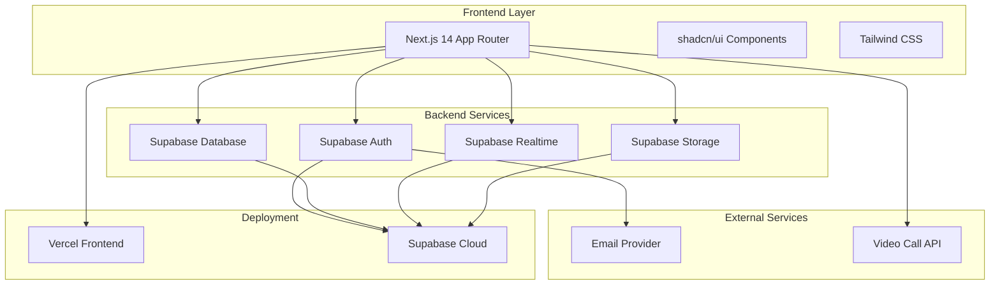

# Design Document

## Overview

The Eagles mentorship platform is built as a modern web application using Next.js 14 with the App Router for the frontend and Supabase as the backend-as-a-service solution. The architecture follows a serverless approach with real-time capabilities, ensuring scalability and maintainability while providing an excellent user experience.

The system is designed around three core user roles (Student, Mentor, Admin) with a session-centric workflow that guides users through the mentorship process from discovery to completion. The platform emphasizes security through university email verification and Row Level Security (RLS) policies, ensuring data privacy and institutional exclusivity.

## Architecture

### System Architecture



### Technology Stack

- **Frontend Framework**: Next.js 14+ with App Router for optimal performance and SEO
- **UI Components**: shadcn/ui for consistent, accessible component library
- **Styling**: Tailwind CSS for utility-first styling approach
- **Backend**: Supabase providing database, authentication, real-time, and storage services
- **Database**: PostgreSQL (via Supabase) with Row Level Security
- **Authentication**: Supabase Auth with email verification
- **Real-time**: Supabase Realtime for chat and live updates
- **File Storage**: Supabase Storage for avatars and file sharing
- **Deployment**: Vercel for frontend, Supabase Cloud for backend services

### Security Architecture

- **Authentication**: University email domain validation with email verification
- **Authorization**: Role-based access control (Student, Mentor, Admin)
- **Data Security**: Row Level Security (RLS) policies for data isolation
- **Session Management**: Secure JWT tokens managed by Supabase Auth
- **File Security**: Signed URLs for secure file access

## Components and Interfaces

### Core Components

#### Authentication Components
- `AuthForm`: Handles login/registration with university email validation
- `EmailVerification`: Manages email verification flow
- `ProtectedRoute`: Wrapper component for authenticated routes

#### User Management Components
- `ProfileForm`: User profile creation and editing
- `AvatarUpload`: Avatar image upload with preview
- `UserCard`: Display user information in various contexts

#### Mentor System Components
- `MentorApplicationForm`: Multi-step form for mentor applications
- `MentorCard`: Display mentor information with quick actions
- `MentorGrid`: Responsive grid layout for mentor browsing
- `FilterBar`: Search and filter controls for mentor discovery

#### Session Management Components
- `SessionRequestForm`: Form for requesting mentorship sessions
- `SessionCard`: Display session information and status
- `SessionDashboard`: Overview of user's sessions
- `StatusBadge`: Visual indicator for session status

#### Communication Components
- `ChatInterface`: Real-time chat with message history
- `MessageBubble`: Individual message display component
- `FileUpload`: File sharing within chat
- `VideoCallButton`: Integration with video calling services

#### Admin Components
- `AdminDashboard`: Overview of platform statistics
- `ApplicationQueue`: List of pending mentor applications
- `ApplicationReview`: Detailed view for reviewing applications
- `AnalyticsChart`: Visual representation of platform metrics

### API Interfaces

#### Authentication Endpoints
```typescript
// Supabase Auth integration
interface AuthService {
  signUp(email: string, password: string): Promise<AuthResponse>
  signIn(email: string, password: string): Promise<AuthResponse>
  signOut(): Promise<void>
  getCurrentUser(): Promise<User | null>
}
```

#### Database Interfaces
```typescript
interface Profile {
  id: string
  email: string
  full_name: string
  department: string
  year: number
  avatar_url?: string
  bio?: string
  created_at: string
}

interface Mentor {
  id: string
  user_id: string
  status: 'pending' | 'approved' | 'rejected'
  expertise_tags: string[]
  achievements: string
  current_role: string
  availability_status: 'available' | 'busy' | 'offline'
  approved_at?: string
  created_at: string
}

interface Session {
  id: string
  student_id: string
  mentor_id: string
  status: 'requested' | 'accepted' | 'scheduled' | 'in_progress' | 'completed'
  topic: string
  message: string
  preferred_format: 'chat' | 'video'
  duration: number
  scheduled_at?: string
  completed_at?: string
  created_at: string
}
```

## Data Models

### Database Schema

#### Core Tables

```sql
-- Profiles (extends Supabase auth.users)
CREATE TABLE profiles (
  id UUID REFERENCES auth.users PRIMARY KEY,
  email TEXT UNIQUE NOT NULL,
  full_name TEXT,
  department TEXT,
  year INTEGER,
  avatar_url TEXT,
  bio TEXT,
  created_at TIMESTAMP DEFAULT NOW(),
  updated_at TIMESTAMP DEFAULT NOW()
);

-- Mentors
CREATE TABLE mentors (
  id UUID PRIMARY KEY DEFAULT gen_random_uuid(),
  user_id UUID REFERENCES profiles(id) UNIQUE,
  status TEXT DEFAULT 'pending' CHECK (status IN ('pending', 'approved', 'rejected')),
  expertise_tags TEXT[],
  achievements TEXT,
  current_role TEXT,
  availability_status TEXT DEFAULT 'available' CHECK (availability_status IN ('available', 'busy', 'offline')),
  approved_at TIMESTAMP,
  created_at TIMESTAMP DEFAULT NOW(),
  updated_at TIMESTAMP DEFAULT NOW()
);

-- Sessions
CREATE TABLE sessions (
  id UUID PRIMARY KEY DEFAULT gen_random_uuid(),
  student_id UUID REFERENCES profiles(id),
  mentor_id UUID REFERENCES profiles(id),
  status TEXT DEFAULT 'requested' CHECK (status IN ('requested', 'accepted', 'scheduled', 'in_progress', 'completed')),
  topic TEXT NOT NULL,
  message TEXT,
  preferred_format TEXT DEFAULT 'chat' CHECK (preferred_format IN ('chat', 'video')),
  duration INTEGER DEFAULT 60,
  scheduled_at TIMESTAMP,
  completed_at TIMESTAMP,
  created_at TIMESTAMP DEFAULT NOW(),
  updated_at TIMESTAMP DEFAULT NOW()
);

-- Messages
CREATE TABLE messages (
  id UUID PRIMARY KEY DEFAULT gen_random_uuid(),
  session_id UUID REFERENCES sessions(id) ON DELETE CASCADE,
  sender_id UUID REFERENCES profiles(id),
  content TEXT,
  message_type TEXT DEFAULT 'text' CHECK (message_type IN ('text', 'image', 'file')),
  file_url TEXT,
  created_at TIMESTAMP DEFAULT NOW()
);

-- Feedback
CREATE TABLE feedback (
  id UUID PRIMARY KEY DEFAULT gen_random_uuid(),
  session_id UUID REFERENCES sessions(id) UNIQUE,
  student_id UUID REFERENCES profiles(id),
  mentor_id UUID REFERENCES profiles(id),
  rating INTEGER CHECK (rating >= 1 AND rating <= 5),
  comment TEXT,
  created_at TIMESTAMP DEFAULT NOW()
);
```

#### Indexes for Performance

```sql
-- Improve query performance
CREATE INDEX idx_mentors_status ON mentors(status);
CREATE INDEX idx_mentors_user_id ON mentors(user_id);
CREATE INDEX idx_sessions_student_id ON sessions(student_id);
CREATE INDEX idx_sessions_mentor_id ON sessions(mentor_id);
CREATE INDEX idx_sessions_status ON sessions(status);
CREATE INDEX idx_messages_session_id ON messages(session_id);
CREATE INDEX idx_messages_created_at ON messages(created_at);
```

### Row Level Security Policies

```sql
-- Profiles: Users can view all profiles but only edit their own
CREATE POLICY "Users can view all profiles" ON profiles
  FOR SELECT USING (true);

CREATE POLICY "Users can update own profile" ON profiles
  FOR UPDATE USING (auth.uid() = id);

-- Mentors: Public read, restricted write
CREATE POLICY "Anyone can view approved mentors" ON mentors
  FOR SELECT USING (status = 'approved' OR user_id = auth.uid());

CREATE POLICY "Users can create own mentor application" ON mentors
  FOR INSERT WITH CHECK (auth.uid() = user_id);

-- Sessions: Only participants can access
CREATE POLICY "Users can view own sessions" ON sessions
  FOR SELECT USING (auth.uid() = student_id OR auth.uid() = mentor_id);

CREATE POLICY "Students can create session requests" ON sessions
  FOR INSERT WITH CHECK (auth.uid() = student_id);

-- Messages: Only session participants can access
CREATE POLICY "Users can view session messages" ON messages
  FOR SELECT USING (
    session_id IN (
      SELECT id FROM sessions 
      WHERE student_id = auth.uid() OR mentor_id = auth.uid()
    )
  );

-- Admin policies (requires custom claims or admin table)
CREATE POLICY "Admins can manage all data" ON mentors
  FOR ALL USING (
    EXISTS (
      SELECT 1 FROM profiles 
      WHERE id = auth.uid() AND email LIKE '%admin%'
    )
  );
```

## Error Handling

### Error Categories

#### Authentication Errors
- Invalid university email domain
- Email verification failures
- Session expiration
- Unauthorized access attempts

#### Validation Errors
- Required field validation
- Data format validation
- File upload restrictions
- Input sanitization failures

#### Business Logic Errors
- Duplicate mentor applications
- Invalid session state transitions
- Unauthorized session access
- Rating submission restrictions

#### System Errors
- Database connection failures
- Real-time subscription errors
- File upload failures
- External API failures

### Error Handling Strategy

```typescript
// Centralized error handling
interface AppError {
  code: string
  message: string
  details?: any
  timestamp: Date
}

class ErrorHandler {
  static handle(error: unknown): AppError {
    if (error instanceof AuthError) {
      return this.handleAuthError(error)
    }
    if (error instanceof ValidationError) {
      return this.handleValidationError(error)
    }
    return this.handleGenericError(error)
  }
  
  static handleAuthError(error: AuthError): AppError {
    return {
      code: 'AUTH_ERROR',
      message: 'Authentication failed. Please try again.',
      details: error.message,
      timestamp: new Date()
    }
  }
}
```

### User-Friendly Error Messages

- **Authentication**: "Please use your university email address to register"
- **Validation**: "Please fill in all required fields"
- **Authorization**: "You don't have permission to access this resource"
- **Network**: "Connection error. Please check your internet and try again"
- **File Upload**: "File size must be less than 5MB"

## Testing Strategy

### Unit Testing
- **Components**: Test individual React components with Jest and React Testing Library
- **Utilities**: Test helper functions and data transformation logic
- **Validation**: Test form validation and input sanitization
- **API Integration**: Mock Supabase client for testing API interactions

### Integration Testing
- **Authentication Flow**: End-to-end user registration and login
- **Session Management**: Complete session lifecycle from request to completion
- **Real-time Features**: Chat message delivery and real-time updates
- **File Upload**: Avatar and file sharing functionality

### End-to-End Testing
- **User Journeys**: Complete user workflows using Cypress or Playwright
- **Cross-browser Testing**: Ensure compatibility across major browsers
- **Mobile Responsiveness**: Test on various device sizes
- **Performance Testing**: Page load times and real-time performance

### Testing Environment Setup

```typescript
// Test configuration
const testConfig = {
  supabase: {
    url: process.env.NEXT_PUBLIC_SUPABASE_TEST_URL,
    anonKey: process.env.NEXT_PUBLIC_SUPABASE_TEST_ANON_KEY
  },
  testDatabase: 'eagles_test',
  mockData: {
    users: generateMockUsers(10),
    mentors: generateMockMentors(5),
    sessions: generateMockSessions(20)
  }
}
```

### Performance Benchmarks
- **Page Load Time**: < 2 seconds for initial page load
- **Real-time Message Delivery**: < 100ms latency
- **Database Queries**: < 500ms for complex queries
- **File Upload**: < 5 seconds for 5MB files
- **Concurrent Users**: Support for 1000+ simultaneous users

### Security Testing
- **Authentication**: Test email domain validation and session security
- **Authorization**: Verify RLS policies prevent unauthorized access
- **Input Validation**: Test against SQL injection and XSS attacks
- **File Upload**: Verify file type restrictions and malware scanning
- **Rate Limiting**: Test API endpoint rate limiting